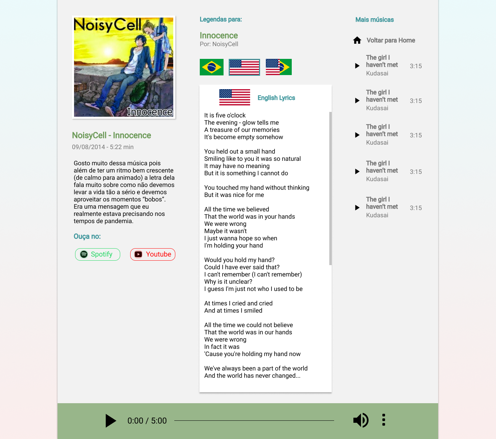

# Atividade de criação de álbum de música WEB 
Atividade proposta pelo professor gabriel do instituto proa com o intuito de praticar habilidades de desenvolvimento web, frizar conceitos e desenvolver a criatividade.

## Proposta
> “Hoje a ideia é bem simples: crie um álbum de músicas que você goste, mas não só isso. Essas músicas precisam refletir aspectos das sua vida. 
> 
> A ideia é que alguém possa te conhecer através daquilo que você ouve. 
> 
> Esse álbum precisa ter uma pagina inicial e cada música será uma página separada, com letra e (se você quiser) um vídeo com um clipe ou montagem da música. O álbum não precisa ser de um artista só e nem toda música tem letra.”

## Coletando Conteúdo
Para começar o projeto eu separei todo o conteúdo que será trabalhado, e isso se refere aos aspectos da minha vida que seriam trabalhados, às músicas que farão parte do álbum, as imagens, letras e um pequeno parágrafo comentando um pouco acerda da relação da música com a minha vida.

## Definindo layout e desing
Com o conteúdo do site praticamente definido, é necessário pensar no design e em como esse conteúdo será disponibilizado.

O 1º passo é definir o wireframe do site, um layout genérico de como o conteúdo será localizado. Depois de alguns rabiscos no papel, o resultado foi esse: 

O 2° passo e montar esse wireframe no figma (ferramenta de prototipagem), adicionando os detalhes do design, paletas de cores etc.

## Montando as páginas
Sobre as tecnologias usadas para desenvolver o projeto, foram usados html para estruturar, css para estilização e Javascript para algumas pequenas interações. Na parte do css, foi usado muito flexbox para fazer estruturas de linhas e colunas.
